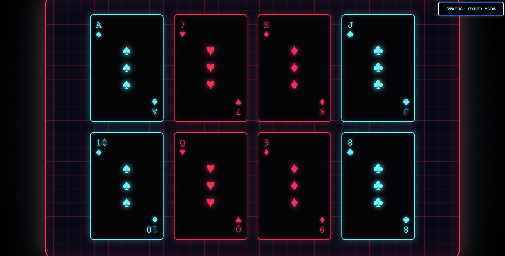

# 🃏 Cyber-Cards: Neon Interface
Cyberpunk-style interactive playing cards interface. Features neon glitch effects, responsive design, and an accessibility-focused "Safe Mode" toggle. Built with pure HTML/CSS/JS.

[](https://opensource.org/licenses/MIT)
[](https://github.com/laddtnov)


[](https://github.com/laddtnov)
[](https://github.com/laddtnov)
A high-fidelity, interactive playing cards terminal inspired by the aesthetics of **Cyberpunk 2077** and **Deus Ex**. This project focuses on advanced CSS animations, digital distortion (glitch) effects, and user-centric accessibility.
you can see the live version of this project here: 
👉 **https://laddtnov.github.io/cyber-cards/**
## 🚀 Live Demo


---

## 📸 Preview

 

---

## ⚡ Key Features

* **Holographic Glitch FX**: Real-time chromatic aberration and digital distortion layers triggered on card hover.
* **Reactive Cyber-Table**: An interactive game board with a pulsating energy grid and dynamic lighting.
* **Accessibility First (Safe Mode)**: A dedicated hardware-style toggle to disable all flickering and animations for light-sensitive users.
* **Reduced Motion Support**: Automatically detects system-level "Reduce Motion" settings via CSS media queries.
* **Fully Responsive**: Seamlessly scales from 4K monitors down to mobile smartphones.

## 🛠 Tech Stack

* **HTML5**: Semantic structure for card geometry.
* **CSS3**: 
    * `Clip-path` & `Keyframes` for glitch logic.
    * `Backdrop-filter` for futuristic frosted glass effects.
    * `CSS Grid/Flexbox` for adaptive layouts.
* **Vanilla JavaScript**: Lightweight state management for the interface modes.

## 🚀 Quick Start

1. Clone the repository:
   ```bash
   git clone [https://github.com/your-username/cyber-cards.git](https://github.com/your-username/cyber-cards.git)

   📜 Accessibility Statement
This project respects the prefers-reduced-motion media query. If you have motion sensitivity, the "Cyber Mode" can be toggled to "Safe Mode" manually via the UI button in the top-right corner.

Created with ⚡ by laddtnov
